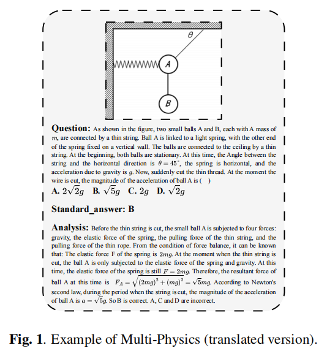
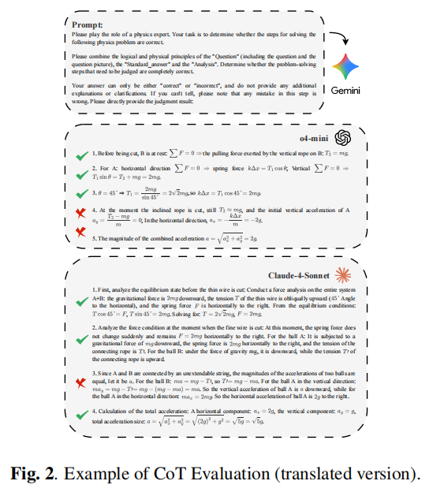
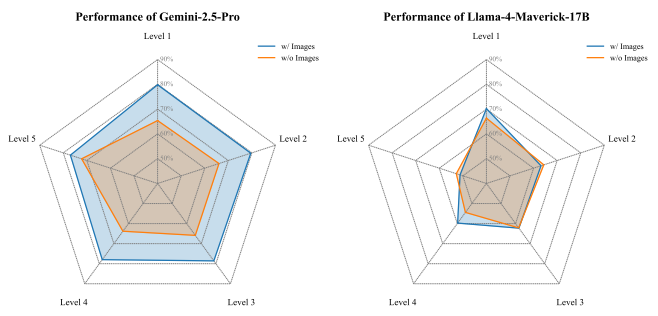
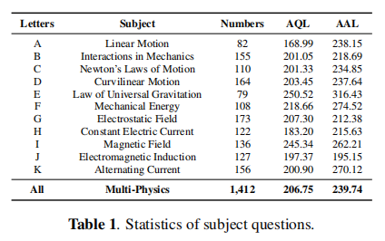
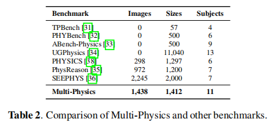
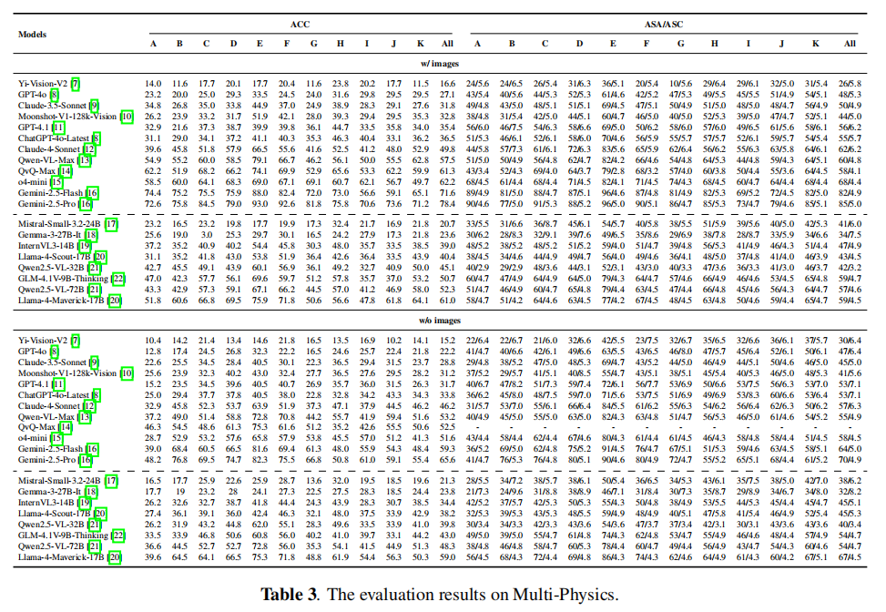

# Multi-Physics: A Comprehensive Benchmark for Multimodel LLMs Reasoning on Chinese Multi-subject Physics Problems

<div align="center">

**Paper:** [https://arxiv.org/abs/2509.15839](https://arxiv.org/abs/2509.15839) <br>

*Zhongze Luo1, Zhenshuai Yin1, Yongxin Guo1, Jionghao Zhu1, Zhichao Wang1, Xiaoying Tang1,2,3**  <br>
1 School of Science and Engineering, The Chinese University of Hong Kong, Shenzhen, China  <br>
2 The Shenzhen Future Network of Intelligence Institute (FNii-Shenzhen), China  <br>
3 The Guangdong Provincial Key Laboratory of Future Networks of Intelligence, China  <br>
*Corresponding author: Xiaoying Tang</em>  <br>

</div>

While multimodel LLMs demonstrate remarkable reasoning progress, their application in specialized scientific domains like physics reveals significant gaps in current evaluation benchmarks. Specifically, existing benchmarks often lack fine-grained subject coverage, neglect the step-by-step reasoning process, and are predominantly English-centric, failing to systematically evaluate the role of visual information. Therefore, we introduce **Multi-Physics** for Chinese physics reasoning, a comprehensive benchmark that includes 5 difficulty levels, featuring 1,412 image-associated, multiple-choice questions spanning 11 high-school physics subjects. We employ a dual evaluation framework to evaluate 20 different MLLMs, analyzing both final answer accuracy and the step-by-step integrity of their Chain-of-Though. Furthermore, we systematically study the impact of difficulty level and visual information by comparing the model performance before and after changing the input mode. Our work provides not only a fine-grained resource for the community but also offers a robust methodology for dissecting the multimodal reasoning process of state-of-the-art MLLMs, and our dataset and code have been open-sourced.

## Citation

```
@inproceedings{luo2026multiphysics,
  title={Multi-Physics: A Comprehensive Benchmark for Multimodal LLMs Reasoning on Chinese Multi-Subject Physics Problems},
  author={Luo, Zhongze and Yin, Zhenshuai and Guo, Yongxin and Wang, Zhichao and Zhu, Jionghao and Tang, Xiaoying},
  booktitle={ICASSP 2026-2026 IEEE International Conference on Acoustics, Speech and Signal Processing (ICASSP)},
  year={2026},
  organization={IEEE}
}
```

## Distribution of difficulty levels



## Example of dataset and CoT Evaluation (Translated)



## Performance results of the two models



## Statistics of subject questions

<div align="center">
  
</div>

## Comparison of Multi-Physics and other benchmarks

<div align="center">
  
</div>

## Evaluation results

<div align="center">
  
</div>

Evaluation results (Evaluation with CoT (Average Step Accuracy/Average Step Count))

## Method

### Different Model API

#### 1. Generate Answers

We have provided the evaluation script of the Google Gemini model for your reference.

You can directly use the following command to invoke `Different Model API` for "w/ images" evaluation, and the generated results will be saved in `./Results/your model name`, please fill in `your api key` in the code file before doing so:

```bash
cd ./Bench
python choice_bench_gemini.py
```

Also, you can directly use the following command to invoke `Different Model API` for "w/o images" evaluation.

```bash
cd ./Bench
python choice_bench_gemini_wo.py
```

In this script, the generated results will be saved in `./Results/gemini-2.5-pro`.

#### 2. Calculate the ACC

You can directly use the following command to calculate the ACC of the answers generated by `Different Model API`, with the results saved in `./Results/your model name`:

```bash
python ACC_evaluation.py --obj_output_dir=../Results/your model name
```

#### 3. Calculate the ASA/ASC

You can directly use the following command to calculate the ASA/ASC of the answers, with the results saved in `./Results/your model name`:

```bash
python CoT_evaluation.py --obj_output_dir=../Results/your model name
```

#### 4. Calculate the performance results at difficulty levels

You can directly use the following command to calculate the performance results at difficulty levels of the answers, with the results saved in `./Results/your model name`:

```bash
python difficultyscore.py --obj_output_dir=../Results/your model name
```

## Acknowledgement

This work is supported in part by the Guangdong Basic and Applied Basic Research Foundation under Grant No. 2025A1515012968, Shenzhen Science and Technology Program under Grant No. JCYJ20240813113502004, National Natural Science Foundation of China under Grant No. 62001412, in part by the funding from Shenzhen Institute of Artificial Intelligence and Robotics for Society, in part by Shenzhen Stability Science Program 2023, and in part by the Guangdong Provincial Key Laboratory of Future Networks of Intelligence (Grant No. 2022B1212010001).

This work was helped by volunteers, and we would like to thank them for their hard work. (Qizhi Zheng, Yi Xiao, Junyu Pan, Zhan Shen, Junhao Wu, Ya Gao, Yang Yu, Yuxi Sun, Mingxin Song, Yanzhe Fan, Peng Yang, Shuangtong Zhu, Zhongyang Cao, Qiwei Song, Mingqi Shao, Jiaming Tian, and Yuting Song)
