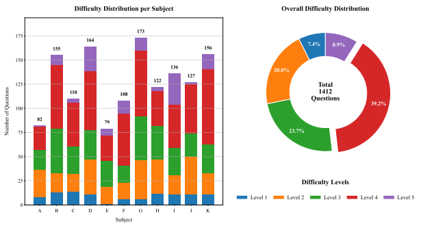
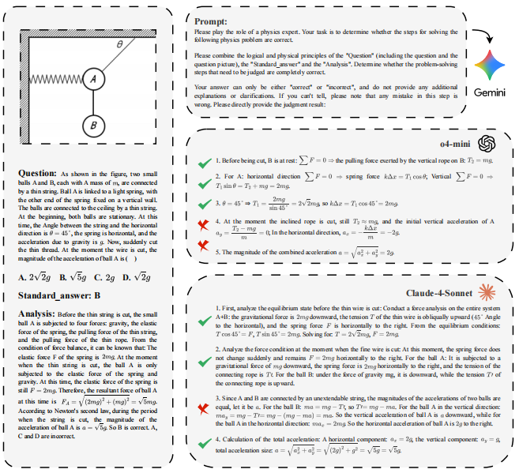

# Multi-Physics: A Comprehensive Benchmark for Multimodel LLMs Reasoning on Chinese Multi-subject Physics Problems

<div align="center">

*Zhongze Luo, Zhenshuai Yin, Yongxin Guo, Jionghao Zhu, Zhichao Wang, Xiaoying Tang**  <br>
School of Science and Engineering, The Chinese University of Hong Kong, Shenzhen, China  <br>
*Corresponding author: Xiaoying Tang</em>  <br>
Email: zhongzeluo@link.cuhk.edu.cn <br>

</div>

While multimodel LLMs demonstrate remarkable reasoning progress, their application in specialized scientific domains like physics reveals significant gaps in current evaluation benchmarks. Specifically, existing benchmarks often lack fine-grained subject coverage, neglect the step-by-step reasoning process, and are predominantly English-centric, failing to systematically evaluate the role of visual information. Therefore, we introduce **Multi-Physics**, a comprehensive benchmark for Chinese physics reasoning, featuring 1,412 image-associated, multiple-choice questions spanning 11 high-school physics subjects. We employ a dual evaluation framework to evaluate 20 different MLLMs, analyzing both final answer accuracy and the step-by-step integrity of their Chain-of-Though. Furthermore, we systematically study the impact of visual information by comparing the model performance before and after changing the input mode. Our work provides not only a fine-grained resource for the community but also offers a robust methodology for dissecting the multimodal reasoning process of state-of-the-art MLLMs, and our dataset and code have been open-sourced.

Please click here to view our paper: [PDF](./paper.pdf)

## Example of Multi-Physics (translated version)



## Example of CoT Evaluation (translated version)



## Statistics of subject questions


## Comparison of Multi-Physics and other benchmarks


## Evaluation results


Evaluation results (Evaluation with CoT (Average Step Accuracy/Average Step Count))

## Method

### Different Model API

#### 1. Generate Answers

We have provided the evaluation script of the Google Gemini model for your reference.

You can directly use the following command to invoke `Different Model API` for "w/ images" evaluation, and the generated results will be saved in `./Results/your model name`, please fill in `your api key` in the code file before doing so:

```bash
cd ./Bench
python choice_bench_gemini.py
```

Also, you can directly use the following command to invoke `Different Model API` for "w/o images" evaluation.

```bash
cd ./Bench
python choice_bench_gemini_wo.py
```

In this script, the generated results will be saved in `./Results/gemini-2.5-pro`.

#### 2. Calculate the ACC

You can directly use the following command to calculate the ACC of the answers generated by `Different Model API`, with the results saved in `./Results/your model name`:

```bash
python ACC_evaluation.py --obj_output_dir=../Results/your model name
```

#### 3. Calculate the ASA/ASC

You can directly use the following command to calculate the ASA/ASC of the answers generated by `Different Model API`, with the results saved in `./Results/your model name`:

```bash
python CoT_evaluation.py --obj_output_dir=../Results/your model name
```

## Acknowledgements

This work was helped by volunteers (Qizhi Zheng, Yi Xiao, Junyu Pan, Zhan Shen, Junhao Wu, Ya Gao, Yang Yu, Yuxi Sun, Mingxin Song, Yanzhe Fan, Peng Yang, Shuangtong Zhu, Zhongyang Cao, Qiwei Song, Mingqi Shao, Jiaming Tian, and Yuting Song). Special thanks for their hard work.
